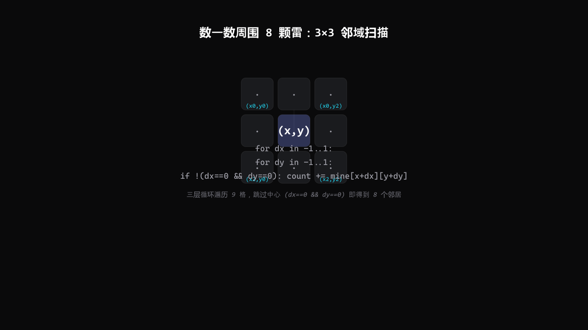

# 从零写一个能玩的 C 语言扫雷

> 发布说明（发布时可删除）
> 本文为 CSDN 草稿包。配图共 6 张（1 封面 + 5 正文），发布时按文末「配图索引」把对应 PNG 上传到 CSDN 并删除占位行即可。正文里所有终端输出均为真实编译运行记录。

扫雷大概是每个学 C 语言的人都会想自己写一个的小游戏：规则大家都懂，但真要落到代码里，怎么同时记住「哪里有雷」和「玩家看到了什么」？怎么数清一颗格子周围有几颗雷？点开一片空白时，为什么能像水波一样自动展开一大片？

这篇文章就带你从一张白纸开始，一步一步写出一份**能编译、能玩、零告警**的 C 语言扫雷。它拆成三个文件：`game.h`（配置与函数声明）、`game.c`（功能实现）、`test.c`（菜单与主流程）。读完后你不仅能拿到一份可运行的代码，更能明白每个设计决定背后的理由。

整份代码已经开源，地址放在第十节。

## 一、我们要做出一个什么样的扫雷

先明确目标，免得写着写着跑偏：

- 棋盘 **9×9**，共 **10 颗雷**（简单难度）。
- 玩家输入坐标 `(行, 列)`，揭开那一格。
- 如果那格周围有雷，显示数字 = 周围 8 格里的雷数；如果是 **0 颗雷**，就自动把周围也揭开（连锁展开）。
- 所有非雷格子都被揭开 = **胜利**；踩到雷 = **失败**。
- **首击保护**：第一次点的那一格保证不是雷，体验更友好。

一份跑起来的样子（真实输出，精简显示）：

```text
==========================
      扫  雷  游  戏
==========================
      1. 开始游戏
      0. 退出游戏
==========================
请选择:> 1

游戏开始！

    1  2  3  4  5  6  7  8  9
   +-------------------------
 1 | *  *  *  *  *  *  *  *  *
 2 | *  1  1  *  *  *  *  *  *
 3 | *  *  *  3  2  *  *  *  *
...
还剩 71 格待排查，请输入坐标（行 列，用空格隔开）:> 5 5
```

最后一行里的 **71** 是还没排查的安全格总数（81 格 − 10 颗雷）。每揭开一个安全格，这个数字就减一，减到 0 就赢了。

## 二、核心思路：用两个棋盘，而不是一个

一个最朴素的想法是：「用一个二维数组存棋盘，有雷写 1，没雷写 0，揭开就打印出来。」

但这里有个绕不过去的矛盾：**同一格，既要记住「它到底有没有雷」（真相），又要记住「玩家现在看不看得见它」（界面）**。如果只用一个数组，你揭开一格、把 1 改成别的值，真相就丢失了——后面数雷、判输赢都没法做。

所以正解是用**两个棋盘，共用同一套坐标 (行, 列)**：

- `mine[][]`：**真相盘**，只有程序自己看。有雷记 `MINE('1')`，没雷记 `SAFE('0')`。
- `show[][]`：**界面盘**，打印给玩家看。没揭开记 `HIDE('*')`，揭开后記数字或空格。


图1：双棋盘模型——`mine` 是标准答案，`show` 是玩家界面，二者用同一套坐标 `(行, 列)`，靠坐标一一对应。

对应 `game.h` 里的字符宏，给这些「魔法字符」起了名字，代码读起来就不费劲：

```c
#define ROW  9
#define COL  9
#define MINE  '1'   /* 雷盘：这一格有雷            */
#define SAFE  '0'   /* 雷盘：这一格没雷            */
#define HIDE  '*'   /* 展示盘：还没被排查          */
#define BLANK ' '   /* 展示盘：已排查，周围 0 颗雷 */
#define BOOM  'X'   /* 结算时显示：没排掉的雷      */
#define STEP  '@'   /* 结算时显示：你踩爆的那一格  */
```

`test.c` 里开一局游戏，就是先建两个 11×11 的数组，再分别初始化：

```c
char mine[ROWS][COLS] = { 0 };   /* 雷盘  ：'0' 没雷，'1' 有雷 */
char show[ROWS][COLS] = { 0 };   /* 展示盘：'*' 未知，数字/空格 已排查 */

InitBoard(mine, ROWS, COLS, SAFE);   /* 雷盘先全填成"没雷" */
InitBoard(show, ROWS, COLS, HIDE);   /* 界面盘先全填成"未排查" */
SetMine(mine, ROW, COL);             /* 在可玩区随机埋 10 颗雷 */
DisplayBoard(show, ROW, COL);        /* 把界面盘打给玩家看 */
FindMine(mine, show, ROW, COL);      /* 进入排雷主循环 */
```

注意这里 `ROWS/COLS` 是 11，而 `ROW/COL` 是 9——为什么数组要比棋盘大一圈？下一节说。

## 三、哨兵边框：用 11×11 装下 9×9

如果数组刚好是 9×9，那数 `(1,1)` 这种角落格子的邻居时，就要写一堆「如果到了边界就别越界」的判断：上边没有、左边没有、左上角没有…… 八个方向就得写八个 `if`，又臭又长还容易漏。

解决办法很巧妙：**把数组开成 11×11，只用中间的 9×9 当棋盘，最外圈那一圈填成「没雷」当占位**。这一圈叫**哨兵边框 / 护城河**。


图2：哨兵边框——11×11 数组里，外圈（高亮框外）全是占位的「没雷」，只有框内 9×9 是玩家真正能点的棋盘。

有了这圈边框，数 `(x,y)` 周围 8 格时，你大可以放心写 `x-1 / x+1 / y-1 / y+1`，就算 `x==1`，`x-1` 也只摸到第 0 行的边框（那里是 `'0'`），**绝不会数组越界**，也不用任何边界判断。

配合宏定义，改棋盘大小只动一个数字：

```c
#define ROW  9
#define COL  9
#define ROWS (ROW + 2)   /* 数组行数 = 可玩行数 + 上下两条边框 */
#define COLS (COL + 2)   /* 数组列数 = 可玩列数 + 左右两条边框 */
#define EASY_COUNT 10     /* 雷的总数 */
```

> **踩坑提醒**：宏里 `ROW + 2` 一定要写成 `(ROW + 2)` 加括号。否则哪天写出 `ROWS * 2`，宏展开会变成 `ROW + 2 * 2 = 13` 而不是你想要的 `(9+2)*2 = 22`。凡是宏定义里的表达式，一律用括号包起来。

## 四、第一步：初始化与打印棋盘

两个棋盘都靠同一个 `InitBoard` 填成同一个字符。注意循环要 **0 到 rows-1**，把最外圈边框也一起填了——调用时传的就是 `ROWS/COLS`（11），不是 `ROW/COL`（9）。

```c
void InitBoard(char board[ROWS][COLS], int rows, int cols, char set)
{
    int i = 0, j = 0;
    for (i = 0; i < rows; i++)
        for (j = 0; j < cols; j++)
            board[i][j] = set;
}
```

打印棋盘只显示中间的 1..row / 1..col，**边框那一圈不给玩家看**。对齐有个小技巧：行号前缀占 4 格，每个格子占 3 格（`" %c "`），列号也占 3 格，这样列号正好压在对应格子的正上方。

```c
void DisplayBoard(char board[ROWS][COLS], int row, int col)
{
    int i = 0, j = 0;
    printf("\n");
    printf("    ");                       /* 给左边行号让 4 格 */
    for (j = 1; j <= col; j++) printf("%2d ", j);
    printf("\n");
    printf("   +");
    for (j = 1; j <= col; j++) printf("---");
    printf("\n");
    for (i = 1; i <= row; i++)
    {
        printf("%2d |", i);
        for (j = 1; j <= col; j++) printf(" %c ", board[i][j]);
        printf("\n");
    }
    printf("\n");
}
```

## 五、第二步：布雷与首击保护

埋雷很简单：在可玩区里随机挑坐标，是空位就放雷，直到放满 `EASY_COUNT` 颗。`rand() % row + 1` 正好落在 `1..row`，也就是可玩区的下标。

```c
void SetMine(char board[ROWS][COLS], int row, int col)
{
    int count = 0;
    while (count < EASY_COUNT)
    {
        int x = rand() % row + 1;
        int y = rand() % col + 1;
        if (board[x][y] == SAFE)   /* 这个位置还没雷，才放 */
        {
            board[x][y] = MINE;
            count++;
        }
    }
}
```

光有随机还不够友好。经典扫雷第一下就可能踩雷，纯看运气。加一个**首击保护**：第一次点的那一格如果是雷，就把它取消，再随便找个空位补一颗——雷的总数不变，游戏依然公平。

```c
static void MoveMineAway(char mine[ROWS][COLS], int row, int col, int x, int y)
{
    mine[x][y] = SAFE;                 /* 先把踩到的雷撤掉 */
    while (1)
    {
        int nx = rand() % row + 1;
        int ny = rand() % col + 1;
        if (mine[nx][ny] == SAFE && !(nx == x && ny == y))
        {
            mine[nx][ny] = MINE;       /* 在别处补一颗 */
            break;
        }
    }
}
```

> **踩坑提醒**：随机数种子 `srand` **整个程序只调用一次**，放在 `main` 开头。如果把它写进每局游戏里，同一秒内连开两局，`time(NULL)` 种子相同，`rand()` 序列就相同，雷的位置会一模一样。

## 六、第三步：数一数周围有几颗雷（3×3 扫描）

这是扫雷的灵魂函数。以 `(x,y)` 为中心，遍历它周围 3×3 共 9 个格子，**跳过中心自己**，数有几个是雷。靠的就是上一节的哨兵边框——这里可以放心写 `x-1 / x+1` 而不用判边界。


图3：3×3 邻域扫描——两层循环遍历中心周围的 9 格，跳过中心 `(x,y)` 自己，剩下的 8 个就是邻居。

```c
static int GetMineCount(char mine[ROWS][COLS], int x, int y)
{
    int count = 0, i = 0, j = 0;
    for (i = x - 1; i <= x + 1; i++)
        for (j = y - 1; j <= y + 1; j++)
        {
            if (i == x && j == y) continue;   /* 跳过中心格自己 */
            if (mine[i][j] == MINE) count++;
        }
    return count;
}
```

> **踩坑提醒**：`if (i == x && j == y) continue;` 这句跳过中心绝对不能省。忘了它，就会把 `(x,y)` 自己那颗雷也算进去，周围雷数凭空多 1，整张棋盘数字全错。

最后还有个经常让人愣一下的写法：把数字写回界面盘时，用的是 `count + '0'` 而不是 `count`。

```c
show[x][y] = (char)(count + '0');   /* 数字转字符：3 + '0' == '3' */
```

因为字符 `'0'` 在 ASCII 里的编码是 48，`'1'` 是 49…… 所以 `3 + '0'` 得到的就是字符 `'3'`。这是 C 语言里把 0~9 的数字变成对应字符的标准小技巧。

## 七、第四步：连锁展开（递归的三条出口）

点开一片空白时，它能自动把周围一大片都揭开，像水波一样散开。这靠**递归**实现。函数 `Expand` 的返回值，是这次一共新翻开了多少个格子。

关键在三条出口，少一条都会出事：

- **A. 这格已经翻开过** → 立刻返回 0，一个都不新翻。这是递归的「刹车」，没有它两个相邻的空格会互相调用，无限递归直接爆栈。
- **B. 周围有雷（count > 0）** → 显示数字，返回 1，不再往外扩。
- **C. 周围没雷（count == 0）** → 标成空白，然后对 8 个邻居各调用一次自己，继续扩散。


图4：连锁展开——从一颗空格（中心）出发，蓝色越深离中心越近；遇到数字就停（出口 B），遇到空格继续向 8 邻居扩散（出口 C），已翻开则刹车（出口 A）。

```c
static int Expand(char mine[ROWS][COLS], char show[ROWS][COLS], int x, int y)
{
    int count = 0, revealed = 0, i = 0, j = 0;

    if (show[x][y] != HIDE) return 0;          /* A. 已翻开过，刹车 */

    count = GetMineCount(mine, x, y);
    if (count > 0)                            /* B. 周围有雷，显示数字就停 */
    {
        show[x][y] = (char)(count + '0');
        return 1;
    }

    show[x][y] = BLANK;                        /* C. 周围没雷，标空白 */
    revealed = 1;
    for (i = x - 1; i <= x + 1; i++)
        for (j = y - 1; j <= y + 1; j++)
            if (i >= 1 && i <= ROW && j >= 1 && j <= COL)   /* 别越进边框 */
                revealed += Expand(mine, show, i, j);
    return revealed;
}
```

这里有个让人安心的事实：**自动展开永远不会踩雷**。因为能走进 `C` 分支的格子，周围 0 颗雷，那它的 8 个邻居里自然也不可能藏着雷——所以扩散到的下一批格子必定安全。雷只存在于 `mine` 盘上，而 `Expand` 只读 `mine`、只改 `show`，从不会去「动」雷。

## 八、第五步：输入、游戏循环与胜利判定

把前面几块拼起来，就是主循环。先用一张流程图把「每一步怎么走」看清楚：


图5：游戏主循环——拿到坐标后先判合法，再判是否已揭开，再判是否踩雷，最后数雷并决定展开或显示数字，直到胜利或踩雷。

读坐标用一个 `ReadCoord`，它检查 `scanf` 的返回值：成功读到两个整数返回 1，格式不对（比如输了字母）返回 0，输入流结束返回 -1。格式不对时用 `getchar()` 把这一行脏数据全部吃掉，避免它留在缓冲区里让下一轮 `scanf` 接着出错。

```c
static int ReadCoord(int* x, int* y)
{
    int ret = scanf("%d %d", x, y);
    if (ret == EOF) return -1;
    if (ret != 2)                      /* 没读到两个整数 */
    {
        int ch = 0;
        while ((ch = getchar()) != '\n' && ch != EOF) ;  /* 清空整行 */
        return 0;
    }
    return 1;
}
```

排雷主循环 `FindMine` 把一切串起来。`win` 记已经安全翻开的格子数，目标是 `row*col - EASY_COUNT`（81−10 = 71）。每揭开一个安全格，`win += Expand(...)`。两个关键点：

1. **重复坐标防护**：如果 `(x,y)` 已经揭开过，直接 `continue` 不计分。没有这层保护，反复输入同一个坐标 71 次就能把 `win` 刷到 71 直接「胜利」——这是初版最容易翻车的隐藏 bug。
2. **首击保护**：第一次点击若踩雷，调用 `MoveMineAway` 把雷挪走再继续。

```c
void FindMine(char mine[ROWS][COLS], char show[ROWS][COLS], int row, int col)
{
    int x = 0, y = 0, win = 0;
    int total = row * col - EASY_COUNT;     /* 需要翻开的安全格总数 */
    int first = 1;

    while (win < total)
    {
        int ret = 0;
        printf("还剩 %d 格待排查，请输入坐标（行 列，用空格隔开）:> ", total - win);
        ret = ReadCoord(&x, &y);
        if (ret == -1) { printf("\n输入已结束，本局中止。\n"); return; }
        if (ret == 0)  { printf("输入格式不对，要输入两个数字，比如：3 5\n"); continue; }
        if (x < 1 || x > row || y < 1 || y > col)
        { printf("坐标越界了，行和列都要在 1 ~ %d 之间。\n", row); continue; }
        if (show[x][y] != HIDE)
        { printf("(%d, %d) 已经排查过了，换一个位置吧。\n", x, y); continue; }

        if (first)                          /* 首击保护 */
        {
            first = 0;
            if (mine[x][y] == MINE) MoveMineAway(mine, row, col, x, y);
        }
        if (mine[x][y] == MINE)            /* 踩雷，结算 */
        {
            printf("\n很遗憾，(%d, %d) 是一颗雷，你被炸死了！\n", x, y);
            show[x][y] = STEP;
            RevealAll(mine, show, row, col);
            DisplayBoard(show, row, col);
            printf("提示：@ 是你踩爆的雷，X 是剩下没排掉的雷。\n");
            return;
        }
        win += Expand(mine, show, x, y);    /* 安全，展开并计分 */
        DisplayBoard(show, row, col);
    }
    printf("\n恭喜！%d 颗雷全部避开，排雷成功！\n", EASY_COUNT);
    RevealAll(mine, show, row, col);
    DisplayBoard(show, row, col);
    printf("提示：X 是雷的位置。\n");
}
```

> **踩坑提醒**：新手写扫雷，90% 的「卡死 / 刷屏」都来自这两处——`scanf` 不检查返回值（输字母就无限刷屏），以及重复坐标不拦截（连点同一格就能「胜利」）。把 `ReadCoord` 的返回值和 `show[x][y] != HIDE` 的拦截写好，这两类问题就都堵上了。

## 九、跑起来看看（真实编译与运行记录）

用最严的告警编译，目标是 **0 warning**，这也是检验代码是否干净的最快方式：

```bash
gcc -std=c11 -Wall -Wextra -Wpedantic -o minesweeper.exe test.c game.c
```

上面这条命令执行后没有任何输出，退出码为 0——零告警通过，说明代码是干净的。

实测几种典型输入（节选真实输出）：

```text
还剩 71 格待排查，请输入坐标（行 列，用空格隔开）:> abc
输入格式不对，要输入两个数字，比如：3 5
还剩 71 格待排查，请输入坐标（行 列，用空格隔开）:> 0 0
坐标越界了，行和列都要在 1 ~ 9 之间。
还剩 71 格待排查，请输入坐标（行 列，用空格隔开）:> 5 5
    1  2  3  4  5  6  7  8  9
   +-------------------------
 1 | *  *  *  *  *  *  *  *  *
 2 | *  1  1  *  *  *  *  *  *
 3 | *  *  *  3  2  *  *  *  *
...
```

非法输入只提示一次就继续，不会刷屏；坐标越界被拦下、`win` 不变；正常点开则打印更新后的棋盘。把 71 个安全格全部揭开后，会打印「恭喜！10 颗雷全部避开，排雷成功！」并亮出完整棋盘。

## 十、代码开源与获取

这份扫雷的完整代码（三个源文件 + README + Makefile）已经开源，放在 GitHub 的迷你游戏合集仓库里：

**https://github.com/wangzifan396-wzf/mini-browser-games/tree/main/minesweeper-c**

仓库目录结构：

```text
mini-browser-games/
└── minesweeper-c/
    ├── game.h        # 配置与函数声明（电路板说明书）
    ├── game.c        # 所有功能的实现（零件车间）
    ├── test.c        # 菜单与主流程（总装线）
    ├── Makefile      # 一行 make 即可编译
    └── README.md     # 玩法、编译、设计说明
```

本地编译运行只需两步：

```bash
make            # 等价于 gcc -std=c11 -Wall -Wextra -Wpedantic -o minesweeper test.c game.c
./minesweeper  # Windows 下是 minesweeper.exe
```

想改难度也很简单：把 `game.h` 里的 `ROW / COL / EASY_COUNT` 改掉，比如 `16 / 16 / 40` 就是中等难度，其它代码一行都不用动。

## 十一、结语：你学到了什么，以及能怎么扩展

回头看，一份能玩的扫雷其实只讲了四件事：

1. **双棋盘模型**——用 `mine`（真相）和 `show`（界面）分开存，一个数组装不下两件事。
2. **哨兵边框**——多开一圈占位，省掉所有边界判断，还顺便防越界。
3. **3×3 扫描 + `count + '0'`**——数雷就是遍历邻居、跳过自己，再优雅地把数字变成字符。
4. **递归展开**——三条出口（刹车 / 停 / 扩散）让它像水波一样自动铺开，而且永不踩雷。

如果你想继续练手，可以试着加这些功能：右键**标记旗帜** `F`、计时器与**难度选择**、踩雷后**递归展开全部雷**、甚至用 ncurses 做一个带光标的终端界面。这些都只是在这套骨架上做加法。

如果这篇文章帮你写出了第一个属于自己的小游戏，欢迎去仓库点个 Star，也欢迎在评论区聊聊你踩过的坑。

## 发布信息（发布时可删除）

- 配图索引（上传时按此对应，占位行会自动变为【配图 0N】）：
  - **封面** → `images/cover.png`
  - **图1** → `images/fig1.png`（双棋盘模型）置于「二、核心思路：用两个棋盘，而不是一个」
  - **图2** → `images/fig2.png`（哨兵边框）置于「三、哨兵边框：用 11×11 装下 9×9」
  - **图3** → `images/fig3.png`（3×3 邻域扫描）置于「六、第三步：数一数周围有几颗雷」
  - **图4** → `images/fig4.png`（递归展开水波）置于「七、第四步：连锁展开（递归）」
  - **图5** → `images/fig5.png`（游戏主循环流程图）置于「八、第五步：输入、循环与胜利判定」
- 全文 6 张配图（1 封面 + 5 正文），均为自绘矢量图栅格化输出，1280×720。
- 标题与 `publish-metadata.json` 中的 `title` 严格一致；开源地址指向 `mini-browser-games/minesweeper-c`。
